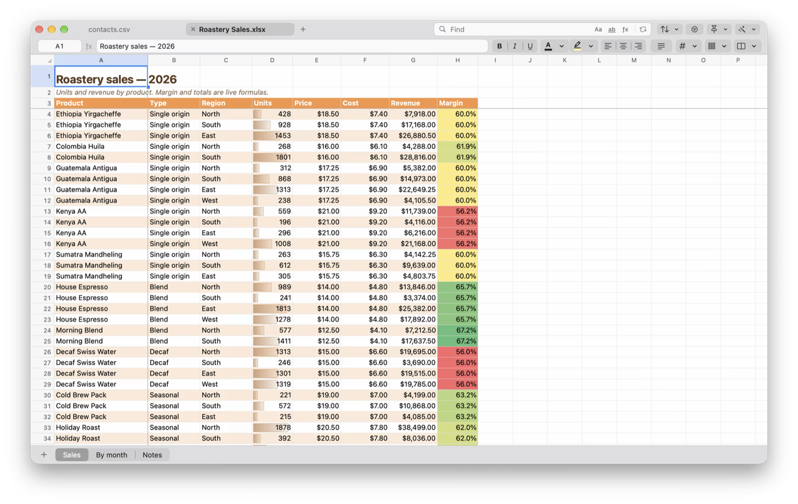

<p align="center">
  <picture>
    <source media="(prefers-color-scheme: dark)" srcset="tools/icon/lockup-dark.png">
    
  </picture>
</p>

<p align="center"><b>A fast, featherweight spreadsheet for the Mac.</b><br>
Open huge CSV and Excel files instantly, clean them up, and save them back exactly as they were.</p>

<p align="center">
  <picture>
    <source media="(prefers-color-scheme: dark)" srcset="site/assets/screenshots/readme-hero-dark.png">
    
  </picture>
</p>

<p align="center"><a href="https://salilchincholikar.github.io/waffle/">Website</a> · <a href="https://github.com/salilchincholikar/waffle/releases/latest">Download</a> · <a href="docs/architecture.md">Architecture</a></p>

---

- **Fast and light.** The app is under 4 MB. Measured on an Apple Silicon Mac:

  | File | Cells | First rows on screen | Whole file loaded | Memory |
  |---|---|---|---|---|
  | CSV, 1,000,000 × 20 (151 MB) | 20 M | 10 ms | 0.7 s | ~260 MB |
  | Excel xlsx, 10,000 × 1,000 (62 MB) | 10 M | 25 ms | 1.7 s | ~90 MB |

  You can work from the first rows while the rest loads in the background. An xlsx takes longer per cell than a CSV: it's compressed XML that has to be unzipped and parsed, while a CSV is plain text.

  Memory is the real limit: roughly 8–13 bytes per cell plus the text. CSV files can have any number of rows; workbook sheets follow Excel's grid (1,048,576 rows × 16,384 columns).
- **Saves "as is".**
  - Untouched parts of an xlsx (charts, pivots, macros, images) are copied byte-for-byte.
  - Unchanged CSV rows are copied exactly, and `00123` stays `00123`. See [docs/fidelity.md](docs/fidelity.md).
- **Native.**
  - Built with AppKit for macOS 26: real document windows, Open Recent, Finder "Open With", trackpad scrolling, dark mode (optionally a dark sheet too).
  - A thin, browser-style title bar with your open files as tabs and one Find for all of them.
- **Formulas.**
  - 195 Excel functions recalculate as you type, following dependencies across sheets and named ranges. See [docs/formulas.md](docs/formulas.md).
- **Clean-up tools.**
  - Trim spaces, remove empty or duplicate rows, change case, standardize dates and amounts (₹1,23,456.78, (1,200), 500 DR…), split text into columns.
  - Sort, filter, find & replace across every open file.
- **Looks like Excel.**
  - Fonts, fills, borders and number formats; merged cells and frozen panes.
  - Conditional formatting (colour scales, data bars), table styles, rich text and images.

**Formats:**
- Open and save: `.xlsx`, `.xlsm`, `.csv`, `.tsv`, `.txt`.
- Import only: `.xls`, `.xlsb`, `.ods` (Save writes a new `.xlsx`).

## Build

Requires macOS 26 (Tahoe) or later.

```sh
xcode-select --install          # Swift toolchain (full Xcode not needed)
curl https://sh.rustup.rs -sSf | sh
make run                        # builds build/Waffle.app and opens it
```

`make test` runs the test suites. `make help` lists everything else.

## How it's built

A Rust engine (`crates/`) owns the data. A Swift/AppKit app (`macos/`) draws only the cells on screen and talks to the engine through a small C interface.

| Crate | What it is |
|---|---|
| [`waffle-calc`](crates/waffle-calc) | Excel-compatible formula engine (no dependencies) |
| [`waffle-numfmt`](crates/waffle-numfmt) | Excel number-format rendering |
| [`waffle-refs`](crates/waffle-refs) | A1 reference parsing, shifting and renaming |
| [`waffle-core`](crates/waffle-core) | Cell storage, styles, editing operations, undo, recalculation |
| [`waffle-io`](crates/waffle-io) | Lossless xlsx, CSV, xls/xlsb/ods import |
| [`waffle-ffi`](crates/waffle-ffi) | C API for the Mac app |

For the details, read [docs/architecture.md](docs/architecture.md). To start contributing, read [docs/development.md](docs/development.md).

## Contributing

Bug reports with a sample file are the most useful thing you can send. See [CONTRIBUTING.md](CONTRIBUTING.md) and the [Code of Conduct](CODE_OF_CONDUCT.md).

## License

Apache-2.0. See [LICENSE](LICENSE) and [NOTICE](NOTICE).
